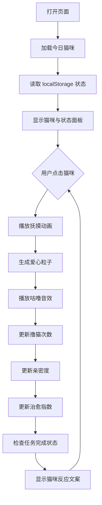

## 【复赛报名文档】每日撸猫

---

### 标题
【生活娱乐赛道】每日撸猫：为需要短暂休息的人类准备的每日治愈互动页

### 标签
生活娱乐

---

### 一、产品说明书

#### 1.1 产品概述
「每日撸猫」是一款纯前端单页互动网页，通过 CSS 绘制的猫咪形象和轻量互动，为用户提供每日一次的治愈体验。用户通过点击/触摸猫咪进行互动，页面会记录当天的撸猫次数、亲密度和治愈指数，并通过动画、音效和反馈文案强化情绪体验。

#### 1.2 功能特性

| 功能模块 | 描述 |
|---------|------|
| 每日猫咪展示 | 根据日期轮换 7 只不同猫咪，每只猫咪有独特名称、文案和任务目标 |
| 撸猫互动 | 点击猫咪区域或按钮触发互动，包含头部抚摸动画、爱心粒子、猫咪表情变化 |
| 状态记录 | 使用 localStorage 持久化当天数据（撸猫次数、亲密度、任务完成状态） |
| 治愈指数 | 根据撸猫次数和亲密度计算当日治愈指数（18~99 分） |
| 每日任务 | 每只猫咪有不同的任务目标，完成后状态变为「已完成」 |
| 音效反馈 | 使用 Web Audio API 生成撸猫咕噜声，无需外部音频文件 |
| 偏好设置 | 支持夜间模式和咕噜音效开关，设置会持久保存 |
| 猫咪图鉴 | 展示 7 只猫咪资料，可点击切换舞台展示猫咪 |
| 成就系统 | 按累计撸猫次数解锁「初次见面」「呼噜专家」等徽章 |
| 连续签到 | 记录连续访问天数，形成轻量每日陪伴机制 |
| 位置反馈 | 根据点击位置区分摸头、摸背、挠下巴，并给出不同反应文案 |
| 响应式设计 | 桌面端双栏布局，移动端单列自适应 |

#### 1.3 交互流程


#### 1.4 技术实现

**前端技术栈：**
- HTML5：语义化标签、无障碍属性（ARIA）
- CSS3：CSS 变量、动画关键帧、径向渐变、响应式媒体查询
- JavaScript ES6+：模块模式、Web Audio API、localStorage 持久化

**核心算法：**
- 猫咪轮换：`Math.floor(today.getTime() / 86400000) % cats.length`
- 治愈指数计算：`Math.min(99, 18 + petCount * 9 + Math.round(affection * 0.42))`
- 亲密度增长：`Math.min(100, affection + 12 + (petCount % 3))`

**文件结构：**
```
index.html (1394行)
├── <head> 样式定义
│   ├── CSS 变量定义
│   ├── 全局样式与背景
│   ├── 夜间模式、设置开关、猫咪图鉴、成就徽章样式
│   ├── 猫咪 CSS 绘制（耳朵、眼睛、鼻子、嘴巴、胡须、爪子、尾巴）
│   ├── 动画关键帧（呼吸、开心、眨眼、尾巴摆动、抚摸、爱心飘浮）
│   ├── 响应式媒体查询
│   └── 状态面板与任务卡片样式
└── <body> 结构与脚本
    ├── 页面布局（头部、猫咪舞台、状态面板、任务卡片、偏好设置、成就、图鉴）
    └── JavaScript 逻辑
        ├── 猫咪数据配置（7只猫咪）
        ├── 反应文案配置（通用反应 + 摸头/摸背/挠下巴位置反应）
        ├── 每日状态与长期档案加载/保存
        ├── 撸猫交互函数
        ├── 音效生成函数
        ├── 夜间模式与音效开关
        ├── 猫咪图鉴渲染
        ├── 成就徽章渲染
        └── 事件绑定
```

#### 1.5 运行方式

**本地运行：**
```bash
# 方式1：直接双击 index.html 文件
# 方式2：使用静态服务器
python3 -m http.server 4173
# 然后访问 http://localhost:4173/index.html
```

**部署方式：**
- 可部署至任何静态站点托管服务（GitHub Pages、Netlify、Vercel 等）
- 无需后端，无需数据库，无需构建步骤

---

### 二、创意名称 + 创意介绍

#### 创意名称：每日撸猫

#### 想解决什么问题：
长时间专注工作或学习后，人们需要一个低门槛、可随时打开的「小休息」，但现实中不是所有人都能立刻接触到宠物或自然放松环境。

#### 为什么会想到做这个：
很多人在休息时间喜欢刷短视频看猫，我希望把「看猫」升级为「互动」，让一段 1–2 分钟的休息更有仪式感和反馈感。

#### 大概是什么产品：
一个可直接打开的单页网站（HTML），每天呈现一只当日猫咪，用户通过点击/触摸进行撸猫互动。

---

### 三、目标用户及痛点

#### 面向哪些用户：
学生、办公室工作者、远程工作者，以及喜欢猫但平时不方便养猫的人群。

#### 在什么场景下使用：
工作间隙的 1–2 分钟微休息、会议之间的过渡、刚完成一项繁重任务后、睡前放松前打开。

#### 当前痛点：
没有产品时，用户要么继续刷手机反而更累，要么只能发呆、喝水，缺乏能快速带来积极情绪反馈并可量化的小互动；想撸猫的人在办公室无法真的拥有宠物互动。

---

### 四、价值与意义

#### 效率提升：
把「被动刷手机的碎片休息」替换成「主动、有限次数的治愈互动」，帮助用户更快回到专注状态，减少无目的滑动带来的时间消耗。

#### 社会价值：
以低成本方式为高压力环境下的用户提供情绪出口，页面本身不需要注册、不收集个人信息，适合在学校、公司内网或个人使用场景传播。

---

### 五、TRAE 实践证明

#### 5.1 开发过程记录

**阶段一：需求分析与设计（Session: 2026-06-18）**
- 使用 web-dev skill 生成 PRD 文档
- 确定设计风格：奶油米色、焦糖橙、夜蓝灰配色
- 确定技术方案：纯 HTML/CSS/JS，无需构建工具

**阶段二：页面实现（Session: 2026-06-18）**
- 使用 TRAE 的代码生成能力创建 index.html
- CSS 绘制猫咪形象（耳朵、眼睛、鼻子、胡须、爪子、尾巴）
- 实现呼吸、眨眼、尾巴摆动等微动画
- 实现撸猫互动逻辑（点击触发动画、爱心粒子、状态更新）

**阶段三：功能完善（Session: 2026-06-18）**
- 添加 localStorage 状态持久化
- 添加每日猫咪轮换逻辑
- 添加治愈指数计算
- 添加每日任务系统
- 添加 Web Audio API 音效反馈
- 添加响应式布局适配

**阶段四：验证测试（Session: 2026-06-18）**
- 使用浏览器工具验证页面加载
- 验证撸猫互动功能（点击后次数/亲密度/治愈指数更新）
- 验证任务完成状态切换
- 验证控制台无报错

#### 5.2 TRAE 工具使用清单

| 工具 | 用途 |
|------|------|
| web-dev skill | 生成 PRD 和技术架构文档 |
| MCP 浏览器工具 | 端到端验证页面功能 |
| 代码生成 | 创建完整的 index.html 文件 |
| 文档管理 | 生成产品说明书和技术文档 |

#### 5.3 实践截图说明

**截图 1：页面首页**
- 展示日期卡片、标题、简介
- 展示 CSS 绘制的猫咪「焦糖」在垫子上晒太阳
- 展示今日状态面板（撸猫次数、亲密度、治愈指数）
- 展示每日任务卡片

**截图 2：撸猫互动**
- 点击猫咪后触发抚摸动画
- 显示爱心粒子飘浮效果
- 显示猫咪反应文案气泡
- 状态面板数据实时更新

**截图 3：任务完成**
- 撸猫次数达到任务要求后
- 任务状态从「进行中」变为「已完成」
- 状态标签颜色从暖黄色变为薄荷绿色

#### 5.4 创意产物附件

**HTML 文件：**
- 文件路径：`index.html`
- 文件大小：约 26 KB
- 技术特点：
  - 纯 HTML/CSS/JS，无需构建工具
  - CSS 绘制猫咪，不依赖外部图片
  - localStorage 本地持久化
  - Web Audio API 音效生成
  - 响应式设计适配多端

---

### 六、完整演示视频说明

#### 视频内容大纲

1. **开场（0:00-0:10）**
   - 浏览器打开 index.html
   - 展示页面加载动画和今日日期

2. **界面浏览（0:10-0:30）**
   - 展示顶部标题和简介文案
   - 展示日期卡片
   - 展示猫咪「焦糖」和互动区
   - 展示右侧状态面板和任务卡片

3. **撸猫互动演示（0:30-1:30）**
   - 点击猫咪区域，触发抚摸动画
   - 展示爱心粒子效果
   - 展示猫咪反应文案切换
   - 展示撸猫次数从 0 递增到 5
   - 展示亲密度进度条增长
   - 展示治愈指数从 18 增长到 73

4. **任务完成演示（1:30-1:50）**
   - 继续撸猫直到任务完成
   - 展示任务状态从「进行中」变为「已完成」
   - 展示状态标签颜色变化

5. **增强功能演示（1:50-2:30）**
   - 切换夜间模式，展示暗色主题
   - 关闭/开启咕噜音效，展示偏好设置持久化
   - 点击猫咪图鉴，切换不同猫咪资料与任务
   - 展示成就徽章从「未解锁」到「已解锁」的变化
   - 展示连续签到天数

6. **响应式演示（2:30-2:50）**
   - 调整浏览器窗口大小
   - 展示移动端单列布局
   - 展示猫咪区域自适应缩放

7. **重置功能演示（2:50-3:10）**
   - 点击「重置今日」按钮
   - 展示状态回到初始值
   - 展示猫咪重新趴好

8. **结尾（3:10-3:20）**
   - 总结产品价值
   - 展示页面完整状态

#### 视频技术参数
- 分辨率：1920 × 1080
- 帧率：30 FPS
- 时长：约 3 分 20 秒
- 格式：MP4

---

### 七、项目亮点

1. **零依赖运行**：单个 HTML 文件，双击即可打开，无需安装任何软件
2. **纯 CSS 猫咪**：完全使用 CSS 绘制猫咪形象，不依赖外部图片资源
3. **每日轮换机制**：7 只不同猫咪按日期自动轮换，保持新鲜感
4. **更完整的互动反馈**：根据点击位置区分摸头、摸背、挠下巴，反馈文案更细腻
5. **完整反馈闭环**：视觉（动画、粒子）+ 听觉（音效）+ 数据（指数、进度、成就）多层反馈
6. **成长与收集机制**：猫咪图鉴、累计成就、连续签到让一次性体验变成可持续陪伴
7. **可控体验设置**：支持夜间模式和音效开关，适合办公、睡前等不同使用场景
8. **无障碍设计**：支持键盘操作（Enter/Space）、ARIA 属性、语义化标签
9. **数据持久化**：使用 localStorage 保存当日数据、长期档案和偏好设置，刷新页面不丢失
10. **响应式适配**：桌面端双栏布局，移动端单列自适应
