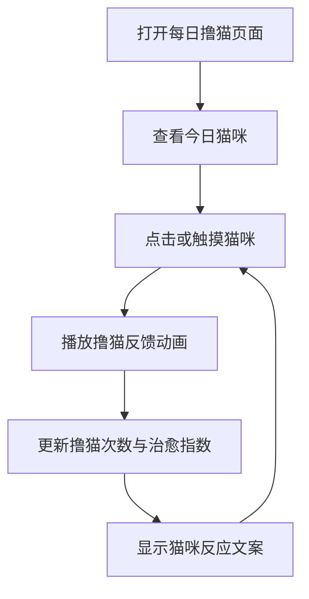

## 1. 产品概述
每日撸猫是一个轻量级单页互动网页，用于提供每日一次的治愈型猫咪互动体验。
- 主要解决用户想快速放松、获得情绪反馈和小仪式感的需求，目标用户是喜欢猫、需要短暂休息的普通用户。
- 产品价值在于用低门槛互动、可爱的视觉反馈和每日状态记录，形成可重复访问的小型网页体验。

## 2. 核心功能

### 2.1 功能模块
1. **首页**：每日猫咪卡片、撸猫互动区、今日心情反馈、计数与状态提示。

### 2.2 页面详情
| 页面名称 | 模块名称 | 功能描述 |
|---|---|---|
| 首页 | 每日猫咪展示 | 展示当天猫咪名称、短句、猫咪形象和环境氛围 |
| 首页 | 撸猫互动 | 用户点击或触摸猫咪后触发动画、音效提示文案和亲密度增长 |
| 首页 | 今日状态 | 显示今日已撸次数、猫咪反应和“今日治愈指数” |
| 首页 | 小任务 | 提供一个每日猫咪任务，例如“轻轻摸摸头三次” |

## 3. 核心流程
用户打开页面后看到今日猫咪，点击猫咪进行撸猫互动，页面更新亲密度、反馈文案和治愈指数，并通过动画强化反馈。

## 4. 用户界面设计

### 4.1 设计风格
- 主色：奶油米色、焦糖橙、夜蓝灰；强调色使用薄荷绿和暖黄色。
- 按钮风格：圆润胶囊按钮，轻微内阴影与柔和高光，模拟柔软触感。
- 字体和字号：标题使用带温度的衬线字体风格，正文使用清晰的人文无衬线；大标题 44px 起，正文 16px。
- 布局风格：桌面优先，中央舞台式布局，猫咪互动区作为视觉焦点，状态信息以浮动卡片环绕。
- 图标风格：使用 CSS 绘制猫咪和装饰元素，避免依赖外部图片。

### 4.2 页面设计概览
| 页面名称 | 模块名称 | UI 元素 |
|---|---|---|
| 首页 | 顶部信息 | 日期、标题、简短说明、柔和渐变背景 |
| 首页 | 猫咪舞台 | CSS 猫咪、垫子、尾巴动画、点击爱心粒子 |
| 首页 | 互动数据 | 今日撸猫次数、亲密度进度条、治愈指数 |
| 首页 | 每日任务 | 任务卡片、完成状态、引导按钮 |

### 4.3 响应式
采用桌面优先设计，在移动端改为单列布局；猫咪互动区保持大触控面积，按钮和卡片间距适配手指点击。
