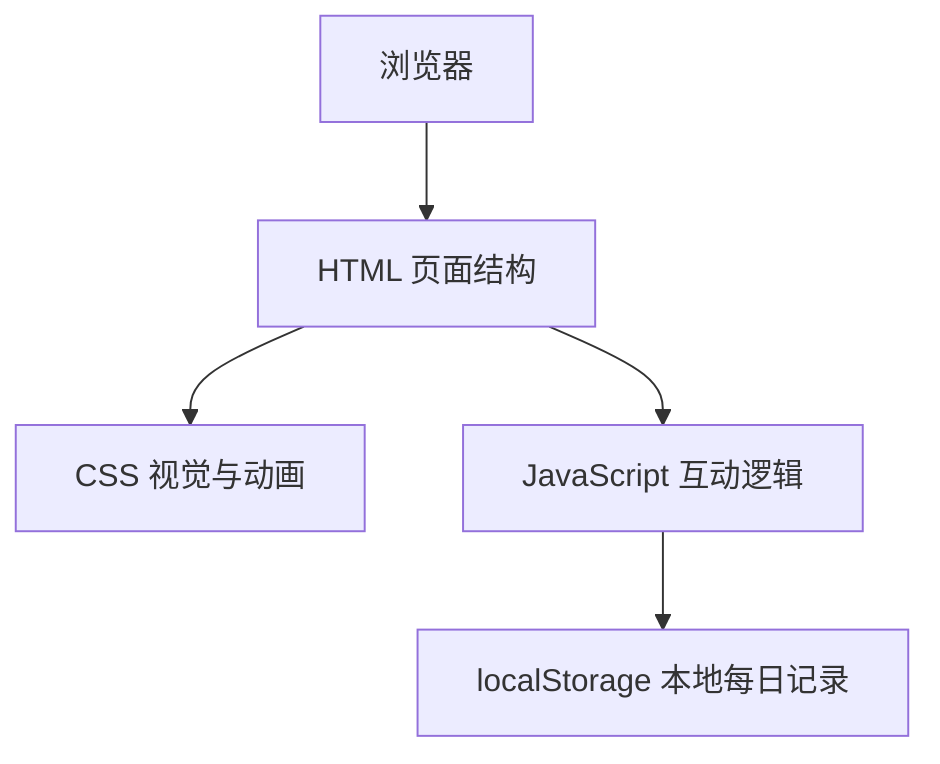
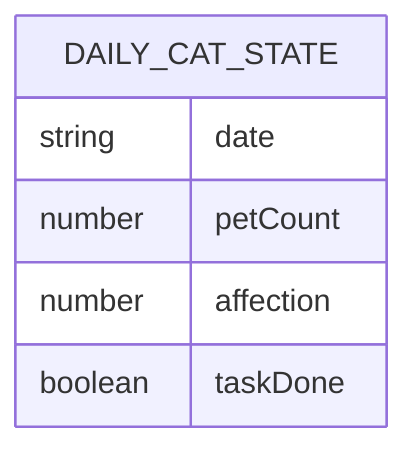

## 1. 架构设计
项目采用静态单页架构，所有交互在浏览器端完成，不依赖后端服务。



## 2. 技术说明
- 前端：原生 HTML5 + CSS3 + JavaScript
- 构建方式：无需构建工具，直接打开 HTML 文件即可运行
- 数据存储：使用 localStorage 保存当天撸猫次数、亲密度和日期
- 外部服务：无

## 3. 路由定义
| 路由 | 用途 |
|---|---|
| / | 每日撸猫单页体验 |

## 4. API 定义
无后端 API。页面内部使用 JavaScript 函数处理以下数据：

```ts
type DailyCatState = {
  date: string;
  petCount: number;
  affection: number;
  taskDone: boolean;
};
```

## 5. 数据模型
### 5.1 数据模型定义
本项目无数据库，仅使用浏览器 localStorage。



### 5.2 数据定义语言
不适用。
